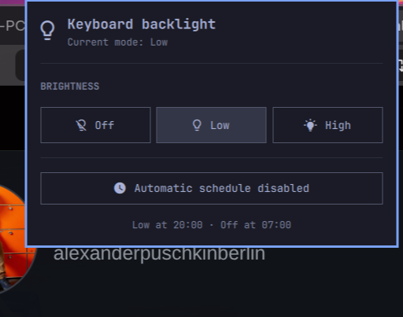
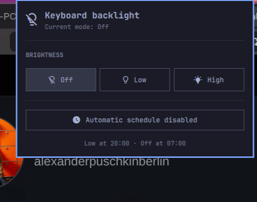
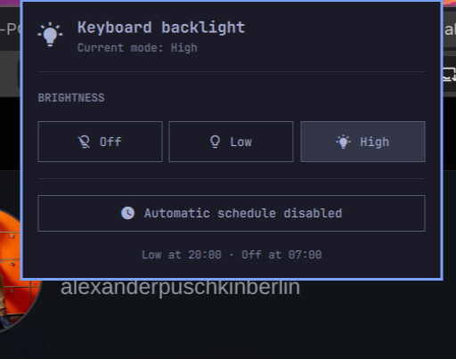
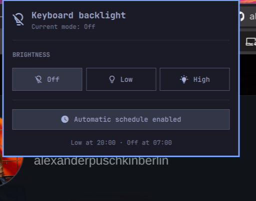

# ThinkPad Keyboard Backlight for Omarchy

A native Omarchy Quattro bar widget for ThinkPad keyboard backlights, designed primarily for laptops that provide manual brightness levels but no automatic ambient-light mode. It shows the current level, provides an Omarchy-style picker for **Off**, **Low**, and **High**, and can reproduce a simple automatic mode with a day/night schedule.



## Screenshots

| Off | Low | High |
| --- | --- | --- |
|  |  |  |

### Automatic mode

The schedule can be enabled directly in the plugin panel. The configured transition times remain visible underneath the switch.



## Features

- State-aware bulb icon in the bar: off, low, or high.
- Left-click opens a native keyboard-friendly panel.
- Right-click cycles through all brightness levels.
- Optional automatic schedule: low at night, off during the day.
- Configurable day and night start hours through Omarchy widget settings.
- No daemon, root access, network access, or background system service.
- Automatically discovers the ThinkPad ACPI LED device exposed as `tpacpi::kbd_backlight` (or another Linux LED matching `*kbd_backlight*`).

## Compatibility

Built and tested on:

- Lenovo ThinkPad X13 Yoga Gen 1 (`20SX0003GE`)
- Lenovo ThinkPad ACPI keyboard backlight (`tpacpi::kbd_backlight`)
- Two hardware brightness steps (`0`, `1`, `2`)
- Omarchy 4 / Quattro shell
- Arch Linux kernel 7.1

The primary target is ThinkPad hardware using the `thinkpad_acpi` kernel driver and exposing `tpacpi::kbd_backlight`, especially models without a built-in automatic keyboard-light sensor mode. It may also work on other laptops whose keyboard backlight appears at `/sys/class/leds/*kbd_backlight*` and can be controlled with `brightnessctl`; those devices are not yet tested. The helper maps **Off** to `0`, **Low** to `1`, and **High** to the device's reported maximum.

This plugin does not read an ambient-light sensor. Its optional schedule is a predictable time-based substitute for ThinkPads that only expose manual lighting levels.

## Requirements

- Omarchy 4 with the Quattro shell plugin system
- `brightnessctl`
- A keyboard backlight exposed as `*kbd_backlight*` in `/sys/class/leds`
- An Omarchy-compatible Nerd Font for the status icons

Check your hardware before installing:

```bash
brightnessctl --list
```

## Installation

```bash
omarchy plugin add https://github.com/alexanderpuschkinberlin/omarchy-keyboard-backlight.git --enable
```

The widget defaults to the right side of the bar. Move it if needed:

```bash
omarchy bar move io.github.alexanderpuschkinberlin.keyboard-backlight --section right
```

## Usage

- **Left-click:** open the mode picker.
- **Right-click:** cycle through Off, Low, and High.
- **Arrow keys:** move through modes while the panel is focused.
- **Enter/Space:** apply the selected mode.
- **Escape:** close the panel.

The active mode is highlighted in the panel and reflected by the bulb icon in the bar.

## Automatic schedule

Scheduling is disabled by default and must be enabled explicitly in the panel or widget settings. Defaults:

- Night begins at `20:00`: set the backlight to Low.
- Day begins at `07:00`: turn the backlight Off.

Configure it with the Omarchy bar commands:

```bash
omarchy bar set io.github.alexanderpuschkinberlin.keyboard-backlight scheduleEnabled true --json
omarchy bar set io.github.alexanderpuschkinberlin.keyboard-backlight nightStartHour 20 --json
omarchy bar set io.github.alexanderpuschkinberlin.keyboard-backlight dayStartHour 7 --json
```

The plugin evaluates transitions inside `omarchy-shell`. It applies the relevant mode when enabled or loaded and then only when the day/night period changes, so manual adjustments are not repeatedly overwritten.

## Privacy and security

The plugin:

- reads the current keyboard LED brightness from the local system;
- invokes only its bundled helper and the installed `brightnessctl` command;
- does not use the network;
- does not use `sudo` or `pkexec`;
- does not install services or modify files outside Omarchy's normal inline widget settings.

Like every Omarchy shell plugin, its QML runs unsandboxed inside `omarchy-shell`. Review the source before enabling it.

## Troubleshooting

### No keyboard light is found

Run:

```bash
find /sys/class/leds -maxdepth 1 -name '*kbd_backlight*' -print
```

If it returns nothing, the kernel does not currently expose a compatible keyboard backlight.

### The icon appears but brightness does not change

Verify direct access:

```bash
brightnessctl -d tpacpi::kbd_backlight set 1
```

Replace the device name with the one shown by `brightnessctl --list`.

### Reload the plugin

```bash
omarchy-shell shell rescanPlugins
omarchy restart shell
```

## Removal

```bash
omarchy plugin remove io.github.alexanderpuschkinberlin.keyboard-backlight
```

## License

MIT — see [LICENSE](LICENSE).
